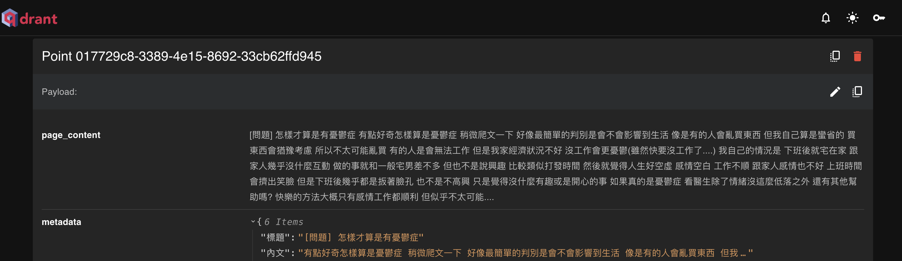

# MentalHealthRAG

## 介紹
MentalHealthRAG的主要目的是評估和分析文章中對精神疾病的態度。這樣的態度可以顯示出人們在面對心理健康問題時，是否願意去看醫生。

## 截圖

## 範例說明

基於特定的標註規則來評估文章中的情感。每篇文章根據以下標註進行分類，例如：

- 1：尋求醫生幫助
- 0：不尋求醫生幫助

假設有一篇文章，內容如下：

> "最近心情一直不太好，但我從來沒去過心理醫生。我覺得自己應該能夠克服這些情緒，不想讓別人知道我的困擾。"

在這篇文章中，作者顯示出對專業協助的抗拒。因此，這篇文章會被標註為 **0**，即不尋求醫生幫助。

另一篇文章的內容可能是：

> "我有時會感到情緒低落，偶爾會考慮去看心理醫生，但總是覺得家裡的人不會支持我。"

這篇文章表現出有意願尋求醫生幫助，因此，它會被標註為 **1**。

## 如何使用 MentalHealthRAG

1. **建立向量資料庫**：
    - 首先，將所有訓練資料進行處理，並使用LLM（大語言模型）生成相應的嵌入向量（embedding）。這些嵌入向量將被存入向量資料庫中，這樣可以進行後續的檢索工作。
2. **準備 Prompt 文件**：
    - 撰寫並準備好對應的 prompt.txt 文件，這個文件將用於引導模型進行特定的分析。文件中應包含如何理解和處理待分析文章的提示與指引。
3. **預測文章的情感分析**：
    - 將待分析的文章輸入系統。系統會根據內部的檢索機制從向量資料庫中檢索出與文章最相關的內容，並將這些相關資訊作為上下文提供給LLM進行分析。
4. **生成結果**：
    - LLM會根據檢索到的相關資料和 prompt.txt 文件的指引，對文章進行心理健康求助態度的分析，最終給出對應的結果，通常以分數的形式呈現。